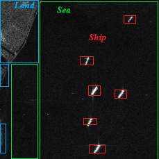
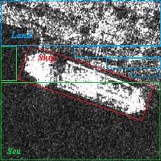

# SGPMamba
Official implementation of "SGPMamba: A Physical Scattering-Guided Prior-Enhanced Mamba Model for High-Fidelity SAR Ship Generation in Complex Backgrounds"
## 🚀 News
- **[2026/07]**: The paper is currently under review in *International Journal of Applied Earth Observation and Geoinformation*.
- **[2026/07]**: Added plans to release the **Improved SAR Datasets** (manually refined HRSID/SSDD with optimized annotations).
## 🏗️ Model Architecture

*Figure 1: The proposed SGPMamba framework, featuring Scattering-Guided Priors (SGP) and Mamba-based generative backbone.*

## 📊 Visual Results on HRSID

*Figure 2: Comparison of synthesis results on the HRSID dataset. Our SGPMamba achieves superior texture details and physical scattering consistency.*

## 📊 Visual Results on SSDD

*Figure 3: Comparison of synthesis results on the SSDD dataset. Our SGPMamba achieves superior texture details and physical scattering consistency.*

## 📦 Improved Datasets
To enhance the training robustness for maritime Earth observation, we provide refined versions of the widely used SAR datasets:
- **Refined HRSID & SSDD**: We performed manual data augmentation, including precise **rotation transformations** and **horizontal bounding box (HBB)** recalibration.
- **Enhanced Utility**: These refinements address the orientation sensitivities of SAR sensors, ensuring high-fidelity generation and more accurate downstream ship detection.
- 
 
*Figure 4: Perform rotation box and horizontal box annotations on the HRSID and SSDD datasets

## 🛠️ Requirements
- Python 3.8+
- PyTorch 1.12.0
- CUDA 11.3
- (See `requirements.txt` for full dependencies)

## 📂 Code & Data Release
> **Notice**: The following assets will be fully released immediately upon acceptance:
> 1. **Source Code**: Complete implementation of SGPMamba and the GUI system.
> 2. **Pre-trained Weights**: Optimized models for HRSID and SSDD.
> 3. **Improved Datasets**: The manually refined and augmented versions of HRSID/SSDD used in this study.
> 
> *We are committed to promoting the reproducibility of SAR generative research.*
